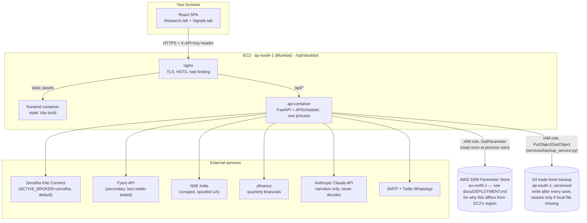
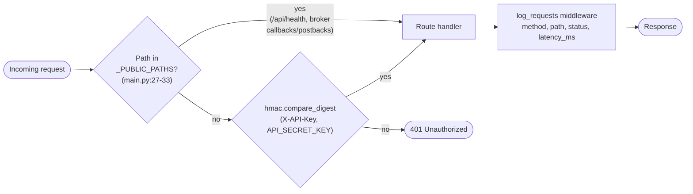
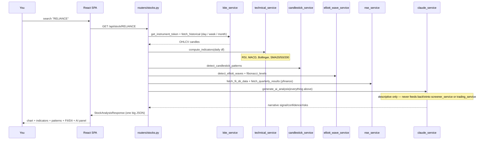
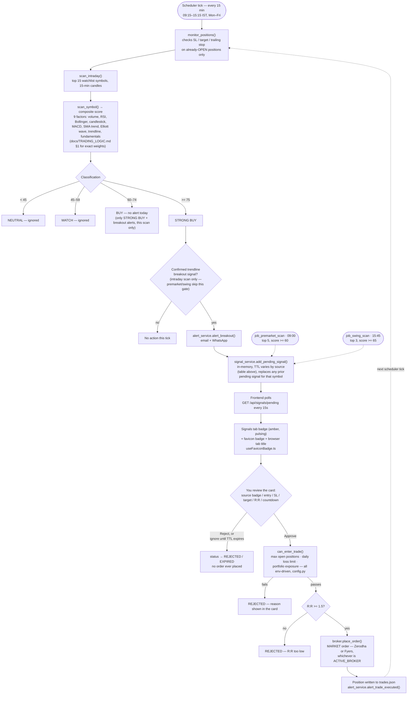
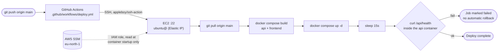

# Architecture — how Jarvis actually fits together

Diagrams companion to the prose docs (`TRADING_LOGIC.md`, `SECURITY.md`, `DEPLOYMENT.md`). These render natively on GitHub and in VS Code (with a Mermaid extension) — no external tool needed. Current as of 2026-07-17.

**Reading order if you're new to the codebase:**
1. System overview (below) — what talks to what
2. Request lifecycle — how every request gets authenticated
3. Stock research flow — the thing the UI does today, end to end
4. Trading decision + approval flow — the most important diagram in this doc, the actual money-moving path
5. Deployment flow — how a code change reaches production

---

## 1. System overview

**One process, one file of trading state.** There's no database — `backend/data/trades.json` (gitignored) is the sole source of truth for open positions and P&L, held in a module-level singleton in `trading_service.py` and rewritten after every mutation. If the container restarts, in-memory-only state (pending signals, broker access tokens) is gone; `trades.json` survives because it's a named Docker volume, not a container layer — and now also backs up to S3 after every save so it survives the *instance itself* being replaced, not just the container.

---

## 2. Request lifecycle — how every request gets authenticated

One key gates everything except the four public paths — this is a single-user app, there's no per-endpoint auth or roles. See `docs/SECURITY.md` for the threat model behind this design and what's still open.

---

## 3. Stock research flow — `GET /api/stock/{symbol}`

The only thing the frontend's **Research** tab does, but it fans out to six services on every call. No caching — every search re-fetches everything.

If `Claude`'s API key is missing or the call errors, `claude_service` silently falls back to a canned "HOLD/LOW confidence" object — a bad model ID won't surface as a visible error, just a bland narrative (`docs/TRADING_LOGIC.md` §1).

---

## 4. Trading decision + human-approval flow — the core loop

This is the diagram to actually understand before touching `screener_service.py`, `trading_service.py`, or `scheduler_service.py`. **No trade is ever placed without you clicking Approve** — that's the load-bearing fact of the current design (see `docs/SECURITY.md`'s fixed "no global paper-trading switch" finding).

All three scans (premarket, intraday, swing) run the same `scan_symbol()` scoring engine and feed the same `signal_service` queue — they differ only in *which* candidates qualify and *how long* the resulting signal stays valid before expiring unapproved:

| Scan | When | Qualifies | TTL |
|---|---|---|---|
| Premarket | 09:00 | top 5, `score >= 60` | until 15:15 today |
| Intraday | every 15 min, 09:15–15:15 | top 3, `STRONG BUY` + confirmed breakout | 20 min |
| Swing | 15:45 | top 3, `score >= 65` | ~24h (next-day entry) |

The intraday path is the most involved (score → classify → breakout-gate), so that's what the diagram below walks through in detail — premarket/swing skip the breakout gate (any BUY/STRONG BUY with a valid `trade_suggestion` qualifies) but join the exact same queue → poll → approve → broker path shown from "Queue" onward.

**What can still auto-run without a click**: `monitor_positions()` (top of the loop) manages exits — stop-loss, target, and trailing-stop on positions you already approved into — and the 15:15 `job_exit_intraday` force-closes all MIS positions before market close. Neither of those *opens* a new position; they only manage risk on ones a human already said yes to. Every candidate any scan finds — premarket, intraday, or swing — goes through the Signals tab; nothing skips it.

---

## 5. Daily automation timeline

| Time (IST) | Job | Opens new trades? |
|---|---|---|
| 08:30 | `job_auto_login` — scripted Zerodha re-auth | No |
| 09:00 | `job_premarket_scan` — full watchlist + fundamentals, top 5 emailed + queued | Only via your approval in the Signals tab |
| 09:15–15:15, every 15 min | `job_intraday_scan` — see diagram 4 above | Only via your approval in the Signals tab |
| 15:15 | `job_exit_intraday` — square off all MIS positions | No — exits only |
| 15:35 | `job_daily_report` — P&L summary, email/WhatsApp | No |
| 15:45 | `job_swing_scan` — EOD setups for next day, top 3 emailed + queued | Only via your approval in the Signals tab |

Full detail in `docs/TRADING_LOGIC.md` §3.

---

## 6. Deployment flow

No test/lint gate in CI, and no rollback if a container builds and passes the shallow health check but is subtly broken. Full manual-deploy fallback, secret-rotation steps, and a troubleshooting table for failure modes already hit in practice live in `docs/DEPLOYMENT.md`.

---

## Where each diagram's code actually lives

| Diagram | Primary files |
|---|---|
| System overview | `main.py`, `docker-compose.yml`, `nginx/conf.d/`, `config.py` |
| Request lifecycle | `main.py:87-122` |
| Stock research | `routers/stocks.py`, `services/kite_service.py`, `technical_service.py`, `candlestick_service.py`, `elliott_wave_service.py`, `nse_service.py`, `claude_service.py` |
| Trading decision + approval | `services/screener_service.py`, `services/scheduler_service.py`, `services/signal_service.py`, `routers/signals.py`, `services/trading_service.py`, `frontend/src/components/SignalsPanel.tsx` |
| Deployment | `.github/workflows/deploy.yml`, `deploy/add-secrets.sh`, `docker-compose.yml` |
