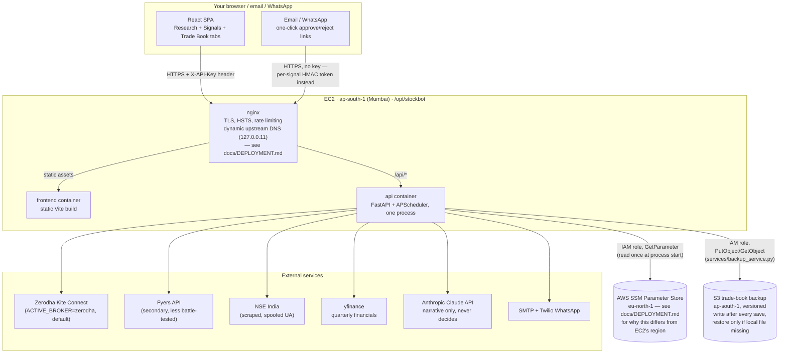
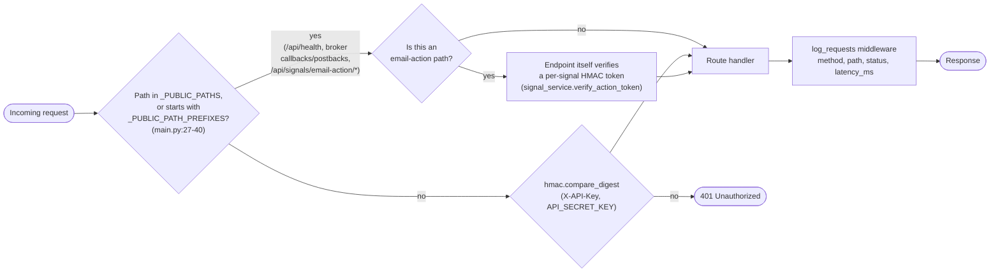
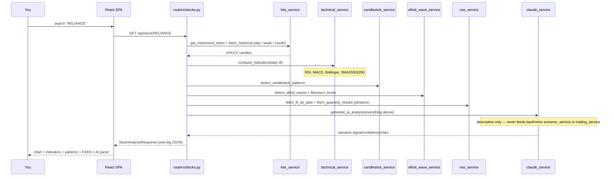
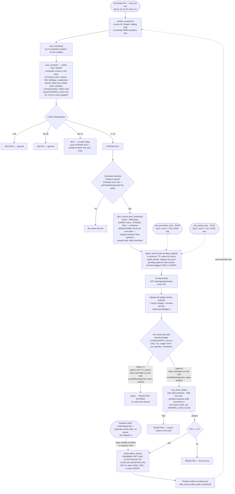
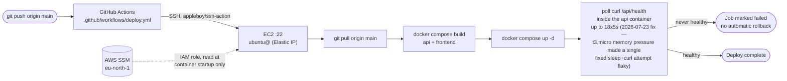

# Architecture — how Jarvis actually fits together

Diagrams companion to the prose docs (`TRADING_LOGIC.md`, `SECURITY.md`, `DEPLOYMENT.md`). These render natively on GitHub and in VS Code (with a Mermaid extension) — no external tool needed. Current as of 2026-08-14.

**Reading order if you're new to the codebase:**
1. System overview (below) — what talks to what
2. Request lifecycle — how every request gets authenticated
3. Stock research flow — the thing the UI does today, end to end
4. Trading decision + approval flow — the most important diagram in this doc, the actual money-moving path
5. Deployment flow — how a code change reaches production

---

## 1. System overview

```mermaid
flowchart TB
    subgraph Client["Your browser / email / WhatsApp"]
        UI["React SPA\nResearch + Signals + Trade Book tabs"]
        Mail["Email / WhatsApp\none-click approve/reject links"]
    end

    subgraph EC2["EC2 · ap-south-1 (Mumbai) · /opt/stockbot"]
        Nginx["nginx\nTLS, HSTS, rate limiting\ndynamic upstream DNS (127.0.0.11)\n— see docs/DEPLOYMENT.md"]
        FE["frontend container\nstatic Vite build"]
        API["api container\nFastAPI + APScheduler, one process"]
    end

    SSM[("AWS SSM Parameter Store\neu-north-1 — see docs/DEPLOYMENT.md\nfor why this differs from EC2's region")]
    S3[("S3 trade-book backup\nap-south-1, versioned\nwrite after every save,\nrestore only if local file missing")]

    subgraph External["External services"]
        Kite["Zerodha Kite Connect\n(ACTIVE_BROKER=zerodha, default)"]
        Fyers["Fyers API\n(secondary, less battle-tested)"]
        NSE["NSE India\n(scraped, spoofed UA)"]
        YF["yfinance\nquarterly financials"]
        Claude["Anthropic Claude API\nnarrative only, never decides"]
        Notify["SMTP + Twilio WhatsApp"]
    end

    UI -- "HTTPS + X-API-Key header" --> Nginx
    Mail -- "HTTPS, no key —\nper-signal HMAC token instead" --> Nginx
    Nginx -- "static assets" --> FE
    Nginx -- "/api/*" --> API
    API -- "IAM role, GetParameter\n(read once at process start)" --> SSM
    API -- "IAM role, PutObject/GetObject\n(services/backup_service.py)" --> S3
    API --> Kite
    API --> Fyers
    API --> NSE
    API --> YF
    API --> Claude
    API --> Notify
```

**One process, one file of trading state.** There's no database — `backend/data/trades.json` (gitignored) is the sole source of truth for open positions and P&L, held in a module-level singleton in `trading_service.py` and rewritten after every mutation. If the container restarts, in-memory-only state (pending signals, broker access tokens) is gone; `trades.json` survives because it's a named Docker volume, not a container layer — and now also backs up to S3 after every save so it survives the *instance itself* being replaced, not just the container.

---

## 2. Request lifecycle — how every request gets authenticated

```mermaid
flowchart LR
    Req(["Incoming request"]) --> Public{"Path in _PUBLIC_PATHS,\nor starts with\n_PUBLIC_PATH_PREFIXES?\n(main.py:27-40)"}
    Public -- "yes\n(/api/health, broker\ncallbacks/postbacks,\n/api/signals/email-action/*)" --> TokenCheck{"Is this an\nemail-action path?"}
    TokenCheck -- "yes" --> Sig["Endpoint itself verifies\na per-signal HMAC token\n(signal_service.verify_action_token)"]
    TokenCheck -- "no" --> Handler["Route handler"]
    Public -- no --> KeyCheck{"hmac.compare_digest\n(X-API-Key, API_SECRET_KEY)"}
    KeyCheck -- no --> R401(["401 Unauthorized"])
    KeyCheck -- yes --> Handler
    Sig --> Handler
    Handler --> LogMW["log_requests middleware\nmethod, path, status, latency_ms"]
    LogMW --> Resp(["Response"])
```

One key gates almost everything — this is a single-user app, there's no per-endpoint auth or roles. The one deliberate exception (`_PUBLIC_PATH_PREFIXES`, added 2026-07-29) is the email/WhatsApp one-click approve/reject path, which can't carry the X-API-Key header at all — it's authorized instead by a narrower, per-signal HMAC token checked inside the endpoint. See `docs/SECURITY.md` for the threat model behind both designs and what's still open.

---

## 3. Stock research flow — `GET /api/stock/{symbol}`

The only thing the frontend's **Research** tab does, but it fans out to six services on every call. No caching — every search re-fetches everything.

```mermaid
sequenceDiagram
    participant You
    participant FE as React SPA
    participant API as routers/stocks.py
    participant Kite as kite_service
    participant TA as technical_service
    participant CS as candlestick_service
    participant EW as elliott_wave_service
    participant NSE as nse_service
    participant AI as claude_service

    You->>FE: search "RELIANCE"
    FE->>API: GET /api/stock/RELIANCE
    API->>Kite: get_instrument_token + fetch_historical (day / week / month)
    Kite-->>API: OHLCV candles
    API->>TA: compute_indicators(daily df)
    Note over TA: RSI, MACD, Bollinger, SMA20/50/200
    API->>CS: detect_candlestick_patterns
    API->>EW: detect_elliott_waves + fibonacci_levels
    API->>NSE: fetch_fii_dii_data + fetch_quarterly_results (yfinance)
    API->>AI: generate_ai_analysis(everything above)
    Note over AI: descriptive only — never feeds back\ninto screener_service or trading_service
    AI-->>API: narrative signal/confidence/risks
    API-->>FE: StockAnalysisResponse (one big JSON)
    FE-->>You: chart + indicators + patterns + FII/DII + AI panel
```

If `Claude`'s API key is missing or the call errors, `claude_service` silently falls back to a canned "HOLD/LOW confidence" object — a bad model ID won't surface as a visible error, just a bland narrative (`docs/TRADING_LOGIC.md` §1).

**Since 2026-08-13, this tab is no longer purely read-only.** Alongside the flow above, `TradeSetupCard.tsx` independently calls `GET /api/scanner/symbol/{symbol}` — the same composite-scoring engine from the trading-decision flow below, run on-demand for whatever symbol you're looking at — and shows an **Approve & Enter** button when a viable setup exists, calling `POST /api/trading/enter` directly. This is a *separate, shorter path* than diagram 4 below: no pending-signal queue, no TTL, no email/WhatsApp alert — you're already looking at the app, so it skips straight from score to a real order on click. Same risk gates (`can_enter_trade()`, R:R ≥ 1.5, position sizing) apply either way.

---

## 4. Trading decision + human-approval flow — the core loop

This is the diagram to actually understand before touching `screener_service.py`, `trading_service.py`, or `scheduler_service.py`. **No trade is ever placed without you clicking Approve** — that's the load-bearing fact of the current design (see `docs/SECURITY.md`'s fixed "no global paper-trading switch" finding).

All three scans (premarket, intraday, swing) run the same `scan_symbol()` scoring engine and feed the same `signal_service` queue — they differ only in *which* candidates qualify and *how long* the resulting signal stays valid before expiring unapproved:

| Scan | When | Qualifies | TTL |
|---|---|---|---|
| Premarket | 09:00 | top 5 LONG, `score >= 60` | until 15:15 today |
| Intraday | every 15 min, 09:15–15:15 | top 3 LONG (`STRONG BUY` + confirmed breakout) **and** top 3 SHORT (`STRONG SELL` + confirmed breakdown, added 2026-08-13) | 20 min |
| Swing | 15:45 | top 3 LONG, `score >= 65` | ~24h (next-day entry) |

The intraday path is the most involved (score → classify → breakout-gate), so that's what the diagram below walks through in detail for the LONG side — the SHORT side runs the exact mirror (`docs/TRADING_LOGIC.md` §1a: bearish scoring on the same data pass, gated on `STRONG SELL` + confirmed BREAKDOWN instead, `trade_type` always `INTRADAY`, and a candidate is skipped entirely if that symbol is already held in either direction) and joins the same queue → poll → approve → broker path. Premarket/swing skip the breakout gate too (any BUY/STRONG BUY with a valid `trade_suggestion` qualifies) but are LONG-only — there's no premarket or swing short-selling, since SHORT is intraday-only by construction.

```mermaid
flowchart TD
    Start(["Scheduler tick — every 15 min\n09:15–15:15 IST, Mon–Fri"]) --> Monitor["monitor_positions()\nchecks SL / target / trailing stop\non already-OPEN positions only"]
    Monitor --> Scan["scan_intraday()\ntop 15 watchlist symbols, 15-min candles"]
    Scan --> Score["scan_symbol() → LONG *and* SHORT\ncomposite scores in one pass\n8-9 factors each: volume, RSI, Bollinger, candlestick,\nMACD, SMA trend, Elliott wave, trendline (+fundamentals, LONG only)\n(docs/TRADING_LOGIC.md §1 / §1a for exact weights)"]
    Score --> Class{"LONG Classification"}
    Class -- "< 45" --> Neutral["NEUTRAL — ignored"]
    Class -- "45–59" --> Watch["WATCH — ignored"]
    Class -- "60–74" --> Buy["BUY — no alert today\n(only STRONG BUY + breakout alerts, this scan only)"]
    Class -- ">= 75" --> Strong["STRONG BUY"]
    Strong --> Breakout{"Confirmed trendline\nbreakout signal?\n(intraday scan only —\npremarket/swing skip this gate)"}
    Breakout -- no --> NoAction["No action this tick"]
    Breakout -- yes --> Alert["alert_service.alert_breakout()\nemail + WhatsApp\n(SHORT mirror: STRONG SELL + confirmed\nBREAKDOWN, PLUS an extra filter —\nskipped entirely if that symbol is\nalready held, either direction)"]
    Alert --> Queue["signal_service.add_pending_signal()\nin-memory, TTL varies by source\n(table above), replaces any prior\npending signal for that symbol,\ndirection-tagged LONG or SHORT"]
    PreMkt(["job_premarket_scan · 09:00\ntop 5, score >= 60, LONG only"]) -.-> Queue
    SwingJob(["job_swing_scan · 15:45\ntop 3, score >= 65, LONG only"]) -.-> Queue
    Research(["Research tab's TradeSetupCard —\nseparate shorter path, no queue,\nsee diagram 3"]) -.->|"skips straight to Broker\non Approve click"| Broker

    Queue --> Poll["Frontend polls\nGET /api/signals/pending every 15s"]
    Poll --> Badge["Signals tab badge (amber, pulsing)\n+ favicon badge + browser tab title\nuseFaviconBadge.ts"]
    Badge --> Human{"You review the card:\ndirection badge (LONG/SHORT) / source /\nentry / SL / target / R:R / est. quantity / countdown"}

    Human -- "Reject, or\nignore until TTL expires\n(also reachable via one-click\nemail/WhatsApp link, token-authed)" --> Closed["status → REJECTED / EXPIRED\nno order ever placed"]
    Human -- "Approve\n(also reachable via one-click\nemail/WhatsApp link, token-authed)" --> Gate["can_enter_trade()\nmax open positions · daily loss limit ·\nportfolio exposure (self-correcting vs.\nlive broker funds, see TRADING_LOGIC.md §2)"]
    Gate -- fails --> RejGate["REJECTED — reason shown in the card"]
    Gate -- passes --> RR{"R:R >= 1.5?"}
    RR -- no --> RejRR["REJECTED — R:R too low"]
    RR -- yes --> Broker["broker.place_order()\nmarketable LIMIT order (0.25% beyond LTP,\ncorrect per-symbol tick size)\nBUY to open LONG / SELL to open SHORT"]
    Broker --> Position["Position written to trades.json\nalert_service.alert_trade_executed()"]
    Position -.->|"next scheduler tick"| Monitor
```

**What can still auto-run without a click**: `monitor_positions()` (top of the loop) manages exits — stop-loss, target (partial 50%-then-runner, see `TRADING_LOGIC.md`), and trailing-stop on positions you already approved into — and the 15:15 `job_exit_intraday` force-closes all MIS positions (LONG and SHORT alike) before market close. Neither of those *opens* a new position; they only manage risk on ones a human already said yes to. Every candidate any scan finds — premarket, intraday, or swing, LONG or SHORT — goes through the Signals tab (or the Research tab's direct-approve path, diagram 3); nothing skips human approval.

---

## 5. Daily automation timeline

| Time (IST) | Job | Opens new trades? |
|---|---|---|
| 08:30 | `job_auto_login` — scripted Zerodha re-auth | No |
| 09:00 | `job_premarket_scan` — full watchlist + fundamentals, top 5 emailed + queued | Only via your approval in the Signals tab |
| 09:15–15:15, every 15 min | `job_intraday_scan` — see diagram 4 above (LONG + SHORT) | Only via your approval in the Signals tab |
| 15:15 | `job_exit_intraday` — square off all MIS positions (LONG and SHORT) | No — exits only |
| 15:35 | `job_daily_report` — P&L summary, email/WhatsApp | No |
| 15:45 | `job_swing_scan` — EOD setups for next day, top 3 emailed + queued | Only via your approval in the Signals tab |

Full detail in `docs/TRADING_LOGIC.md` §3.

---

## 6. Deployment flow

```mermaid
flowchart LR
    Dev(["git push origin main"]) --> GH["GitHub Actions\n.github/workflows/deploy.yml"]
    GH -- "SSH, appleboy/ssh-action" --> EC2["EC2 :22\nubuntu@ (Elastic IP)"]
    EC2 --> Pull["git pull origin main"]
    Pull --> Build["docker compose build\napi + frontend"]
    Build --> Up["docker compose up -d"]
    Up --> Wait["poll curl /api/health\ninside the api container\nup to 18x5s (2026-07-23 fix —\nt3.micro memory pressure made a single\nfixed sleep+curl attempt flaky)"]
    Wait -- "never healthy" --> Fail(["Job marked failed\nno automatic rollback"])
    Wait -- "healthy" --> Done(["Deploy complete"])

    SSM[("AWS SSM\neu-north-1")] -. "IAM role, read at\ncontainer startup only" .-> EC2
```

No test/lint gate in CI, and no rollback if a container builds and passes the shallow health check but is subtly broken. Full manual-deploy fallback, secret-rotation steps, and a troubleshooting table for failure modes already hit in practice live in `docs/DEPLOYMENT.md`.

---

## Where each diagram's code actually lives

| Diagram | Primary files |
|---|---|
| System overview | `main.py`, `docker-compose.yml`, `nginx/conf.d/stockbot.conf`, `nginx/nginx.conf`, `config.py` |
| Request lifecycle | `main.py:27-100`, `services/signal_service.py` (`_action_token`/`verify_action_token`) |
| Stock research (+ Trade Setup card) | `routers/stocks.py`, `services/kite_service.py`, `technical_service.py`, `candlestick_service.py`, `elliott_wave_service.py`, `nse_service.py`, `claude_service.py`, `routers/scanner.py`, `frontend/src/components/TradeSetupCard.tsx` |
| Trading decision + approval | `services/screener_service.py`, `services/scheduler_service.py`, `services/signal_service.py`, `routers/signals.py`, `services/trading_service.py`, `frontend/src/components/SignalsPanel.tsx`, `frontend/src/components/TradeBook.tsx`, `brokers/base.py` + `brokers/zerodha.py` (`get_tick_size`) |
| Deployment | `.github/workflows/deploy.yml`, `deploy/add-secrets.sh`, `docker-compose.yml`, `nginx/conf.d/stockbot.conf` |
